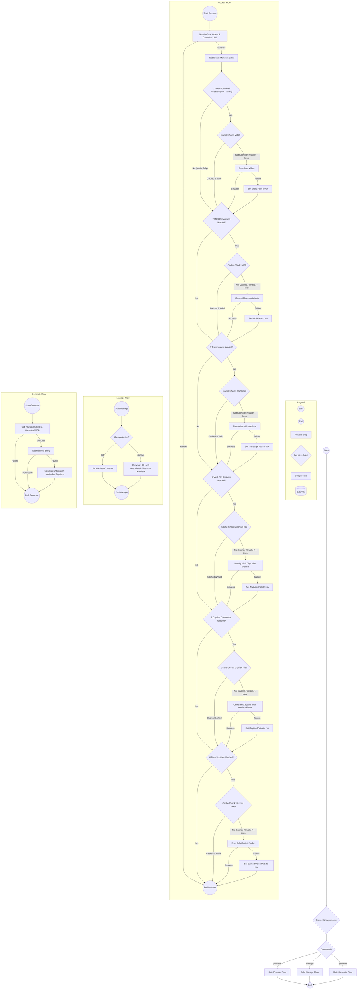

# YouTube Video Processing Toolkit

This project provides a command-line toolkit to download, process, and analyze YouTube videos. It can download videos or audio, transcribe audio content, generate captions, and identify potential viral clips from the transcripts.

## Features

- **YouTube Video/Audio Downloading**:
  - Download videos at specified qualities or the highest available.
  - Download audio-only in MP3 format.
  - Specify custom output directories and filenames.
- **Audio Transcription**:
  - Transcribe audio content from downloaded videos/audio using `stable-ts`.
  - Save transcripts as `.txt` files.
- **Viral Clip Identification**:
  - Analyze transcripts to identify sections with high potential to be engaging or viral short clips.
  - Uses Google Gemini models for analysis.
- **Caption Generation**:
    - Generate caption files (.srt, .ass) using `stable-whisper`.
    - Burn subtitles into the video.
- **Processing Manifest**:
  - Keeps track of processed URLs and their associated files in a CSV manifest (`processing_manifest.csv`).
  - Supports caching: avoids re-processing already completed steps unless forced.
  - Manage the manifest by listing entries or removing specific URLs and their associated files.
- **Flexible Output Configuration**:
  - Specify base output directory.
  - Set custom directories for all generated files.

## Installation

1.  **Prerequisites**:

    - Python 3.x
    - FFmpeg: Ensure FFmpeg is installed and accessible in your system's PATH. It's required for audio extraction and video processing. You can download it from [ffmpeg.org](https://ffmpeg.org/download.html).

2.  **Clone the Repository (if applicable)**:

    ```bash
    git clone <repository-url>
    cd <repository-directory>
    ```

3.  **Set up a Virtual Environment (Recommended)**:

    ```bash
    python3 -m venv venv
    source venv/bin/activate  # On Windows use `venv\Scripts\activate`
    ```

4.  **Install Dependencies**:

    ```bash
    pip install -r requirements.txt
    ```

5.  **Set Environment Variables**:
    - For viral clip identification features, you need a Google API Key.
    - Set the `GOOGLE_API_KEY` environment variable:
      ```bash
      export GOOGLE_API_KEY="YOUR_API_KEY"
      ```
      (On Windows, use `set GOOGLE_API_KEY="YOUR_API_KEY"` for the current session, or set it permanently via system properties.)

## Usage

The script `main.py` is the entry point for all operations. It has three main subcommands: `process`, `manage` and `generate`.

### `process` Command

Use the `process` command to download and analyze a YouTube video.

**Syntax**:

```bash
python3 main.py process <youtube_url> [options]
```

**Arguments & Options**:

- `url`: (Required) The YouTube video URL to process.
- `-o, --output <directory>`: Base output directory for all generated files (default: current directory).
- `-f, --filename <name>`: Custom base filename (no extension) for downloaded files. Defaults to a sanitized version of the video title.
- `--video-quality <yt-dlp_format_string>`: Video quality/format selection for `yt-dlp`. Defaults to `best`. Examples: `bestvideo[height<=720][ext=mp4]`, `best`.
- `--audio-quality <yt-dlp_format_string>`: Audio quality/format selection for `yt-dlp`. Defaults to `bestaudio`. Examples: `bestaudio[ext=m4a]`, `bestaudio`.
- `-a, --audio`: Download audio-only (MP3 format). If specified, no video file will be downloaded.
- `--audio-dir <directory>`: Specific directory for audio files (default: `<output_dir>/audios`).
- `--video-dir <directory>`: Specific directory for video files (default: `<output_dir>/videos`).
- `--transcript-dir <directory>`: Specific directory for transcript files (default: `<output_dir>/transcripts`).
- `--analysis-dir <directory>`: Specific directory for analysis files (default: `<output_dir>/viral_analysis`).
- `--caption-dir <directory>`: Specific directory for caption files (default: `<output_dir>/captions`).
- `--burned-video-dir <directory>`: Directory for videos with burned subtitles (default: `<output_dir>/burned_videos`).
- `--transcribe`: Transcribe the audio and save it as a `.txt` file using `stable-ts`.
- `--viral-short-identifier`: Identify potential viral short clips from the transcript. (Requires `GOOGLE_API_KEY`).
- `--get-viral-timestamps`: Get viral timestamps from viral analysis.
- `--number-of-sections <count>`: Number of viral sections for the AI to find (e.g., `3`, `5`).
- `--clip-identifier-model <model_name>`: Gemini model for clip identification (default: `gemini-1.5-pro-latest`).
- `--generate-captions`: Generate caption files (.srt, .ass) using `stable-whisper`.
- `--whisper-model <model_name>`: Whisper model to use for caption generation (e.g., `tiny`, `small`, `base`, `medium`, `large`). Defaults to `tiny`.
- `--burn-subtitles`: Burn .ass subtitles into the video. Requires `--generate-captions`.
- `--force`: Force re-processing of all steps, ignoring any cached files or statuses in the manifest.
- `--manifest-file <path>`: Path to the processing manifest CSV file (default: `processing_manifest.csv`).

**Examples**:

1.  **Download video, transcribe, and identify viral clips**:

    ```bash
    python3 main.py process "https://www.youtube.com/watch?v=your_video_id" \
        --output "./my_youtube_projects" \
        --transcribe \
        --viral-short-identifier \
        --number-of-sections 3
    ```

2.  **Download audio-only and save to a specific directory**:

    ```bash
    python3 main.py process "https://www.youtube.com/watch?v=your_video_id" \
        --audio \
        --audio-dir "./downloaded_mp3s"
    ```

3.  **Download a video and burn subtitles into it**:
    ```bash
    python3 main.py process "https://www.youtube.com/watch?v=your_video_id" \
        --generate-captions \
        --burn-subtitles
    ```

### `manage` Command

Use the `manage` command to interact with the processing manifest.

**Syntax**:

```bash
python3 main.py manage <action> [options]
```

**Actions**:

- **`list`**: Lists all entries currently in the manifest.
  ```bash
  python3 main.py manage list
  ```
- **`remove <youtube_url>`**: Removes a specific YouTube URL and its associated downloaded files from the manifest and the filesystem.
  ```bash
  python3 main.py manage remove "https://www.youtube.com/watch?v=some_old_video_id"
  ```

### `generate` Command

Use the `generate` command to create a video with hardcoded captions, using the data stored in the manifest. The output video will be saved in the `captioned_videos` directory with a `_captioned.mp4` suffix.

**Syntax**:

```bash
python3 main.py generate <youtube_url>
```

**Arguments & Options**:

- `url`: (Required) The YouTube video URL. This must match an entry in the manifest that has already been processed with the `--generate-captions` flag.

**Example**:

1.  **Generate a video with captions**:
    First, ensure the video has been processed with `--generate-captions`. Then, run:
    ```bash
    python3 main.py generate "https://www.youtube.com/watch?v=your_video_id"
    ```
    This will create a file in the `captioned_videos` directory with a name like `your_video_title_captioned.mp4`.

### Processing a New YouTube Video

To process a brand new YouTube video from start to finish, including downloading, transcribing, identifying viral clips, and generating a video with burned-in subtitles, follow these steps:

1.  **Process the video with transcription, viral clip identification, and caption generation**:
    This command will download the video, transcribe its audio, identify potential viral sections, generate caption files, and burn the subtitles into a new video file.

    ```bash
    python3 main.py process "https://www.youtube.com/watch?v=your_video_id" \
        --output "./processed_videos" \
        --transcribe \
        --viral-short-identifier \
        --number-of-sections 3 \
        --generate-captions \
        --burn-subtitles
    ```

    **Expected Results**:

    - **Video File**: `./processed_videos/videos/your_video_title.mp4`
    - **Audio File**: `./processed_videos/audios/your_video_title.mp3`
    - **Transcript File**: `./processed_videos/transcripts/your_video_title.txt`
    - **Viral Analysis**: `./processed_videos/viral_analysis/your_video_title_viral_analysis.json`
    - **Caption Files**: `./processed_videos/captions/your_video_title.srt`, `your_video_title.ass`
    - **Video with Burned Subtitles**: `./processed_videos/burned_videos/your_video_title.mp4`
    - **Manifest Entry**: An entry for this video will be added to `processing_manifest.csv`.

2.  **Generate the captioned video (alternative method)**:
    If you have already processed a video with `--generate-captions`, you can generate a new video with hardcoded captions using the `generate` command.

    ```bash
    python3 main.py generate "https://www.youtube.com/watch?v=your_video_id"
    ```

    **Expected Results**:

    - **Captioned Video File**: `captioned_videos/your_video_title_captioned.mp4`

## Implementation Plan / TODOs

This section outlines planned enhancements and future project ideas.

### Youtube Video Clipper Enhancements (Current Project)

- [ ] Figure out possible way to automate the process via telegram bot
- [x] Figure out way to download youtube videos
- [x] Figure out way to download youtube videos audio
- [x] Figure out way to download youtube videos transcripts
- [x] Figure out a prompt to find the most plausible parts of the video that are likely to be useful as a reel (max 30-50 seconds)
- [x] Get timestamps for the transcription using `stable-ts`.
- [ ] Figure out a way to automatically clip the video based on the prompt and save the clips (e.g., using FFmpeg with timestamps).

### New Youtube Reel Creator (Future Project Idea)

Theme like: Docker under 60 seconds etc.

- [ ] Given an input, Figure out a way to generate script for the youtube reel (max 60 seconds)
- [ ] Investigate if there is a way to generate a human voice over for the script
- [ ] Figure out a way to generate a video for the script (if possible - might require manual effort for now)

### Common Features & Launch Readiness

- [x] Display captions on the video clip as overlay subtitles using `ffmpeg`.
- [ ] Figure out a way to upload the clips to youtube as reels - might have to use n8n for this or not.
- [ ] Figure out a way to generate a thumbnail for the video clip
- [ ] Figure out a way to generate a title for the video clip
- [ ] Figure out a way to generate a description for the video clip
- [ ] Figure out a way to generate hashtags for the video clip

### Good to Have

- [ ] Add Human-in-the-loop for the script selection/upload step via telegram bot

---

### Other Ideas (Unrelated to current YouTube tools)

- [ ] Idea generator from reddit
- [ ] Twitter Account Automator
- [ ] Medium Article Automator
- [ ] LinkedIn Post Automator

---

## Application Flow


