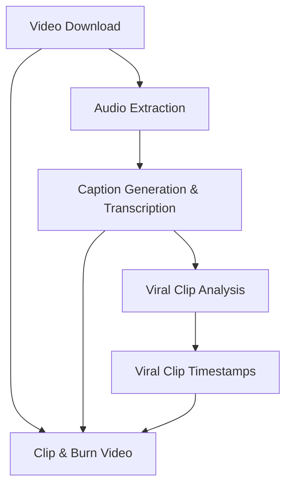

# Project Status: Discontinued

You can read more about the decision and the story of this project in the [blog post](BLOG.md).

# YouTube Video Processing Toolkit

This project provides a command-line toolkit to download, process, and analyze YouTube videos. It now features an intelligent orchestration system that automatically handles dependencies between processing steps, ensuring a smooth and efficient workflow.

## Features

-   **Intelligent Orchestration (DAG-based)**:
    -   The core `process` command now uses a Directed Acyclic Graph (DAG) to manage processing steps.
    -   When you request a specific output (e.g., a clipped video), the orchestrator automatically identifies and executes all necessary prerequisite steps (e.g., download, audio extraction, caption generation, analysis) in the correct order.
    -   Leverages a manifest for robust caching, skipping already completed steps unless forced.
-   **YouTube Video/Audio Downloading**:
    -   Download videos at specified qualities or the highest available.
    -   Download audio-only in MP3 format.
    -   Specify custom output directories and filenames.
-   **Integrated Transcription & Caption Generation**:
    -   Transcribe audio content and generate caption files (.srt, .ass, .txt) using `stable-whisper` in a single step.
-   **Viral Clip Identification & Timestamp Extraction**:
    -   Analyze transcripts to identify sections with high potential for engaging, viral short clips.
    -   Uses Google Gemini models for intelligent analysis and precise timestamp extraction.
-   **Video Manipulation**:
    -   Burn subtitles directly into the video.
    -   Automatically clip viral segments based on identified timestamps.
-   **Processing Manifest**:
    -   Keeps track of processed URLs and their associated files in a CSV manifest (`processing_manifest.csv`).
    -   Manage the manifest by listing entries or removing specific URLs and their associated files.
-   **Flexible Output Configuration**:
    -   Specify base output directory.
    -   Set custom directories for all generated files.

## Installation

1.  **Prerequisites**:

    -   Python 3.x
    -   FFmpeg: Ensure FFmpeg is installed and accessible in your system's PATH. It's required for audio extraction and video processing. You can download it from [ffmpeg.org](https://ffmpeg.org/download.html).

2.  **Clone the Repository (if applicable)**:

    ```bash
    git clone <repository-url>
    cd <repository-directory>
    ```

3.  **Set up a Virtual Environment (Recommended)**:

    ```bash
    python3 -m venv venv
    source venv/bin/activate  # On Windows use `venv\Scripts\activate`
    ```

4.  **Install Dependencies**:

    ```bash
    pip install -r requirements.txt
    ```

5.  **Set Environment Variables**:
    -   For viral clip identification features, you need a Google API Key.
    -   Set the `GOOGLE_API_KEY` environment variable:
        ```bash
        export GOOGLE_API_KEY="YOUR_API_KEY"
        ```
        (On Windows, use `set GOOGLE_API_KEY="YOUR_API_KEY"` for the current session, or set it permanently via system properties.)

## Usage

The script `main.py` is the entry point for all operations. It has two main subcommands: `process` and `manage`.

### `process` Command (Orchestrated Workflow)

Use the `process` command to download, process, and analyze a YouTube video. The orchestrator will automatically determine and execute all necessary preceding steps based on the flags you provide.

**Syntax**:

```bash
python3 main.py process <youtube_url> [options]
```

**Arguments & Options**:

-   `url`: (Required) The YouTube video URL to process.
-   `-o, --output <directory>`: Base output directory for all generated files (default: current directory).
-   `-f, --filename <name>`: Custom base filename (no extension) for downloaded files. Defaults to a sanitized version of the video title.
-   `--video-quality <yt-dlp_format_string>`: Video quality/format selection for `yt-dlp`. Defaults to `best`. Examples: `bestvideo[height<=720][ext=mp4]`, `best`.
-   `--audio-quality <yt-dlp_format_string>`: Audio quality/format selection for `yt-dlp`. Defaults to `bestaudio`. Examples: `bestaudio[ext=m4a]`, `bestaudio`.
-   `--whisper-model <model_name>`: Whisper model to use for caption generation (e.g., `tiny`, `small`, `base`, `medium`, `large`). Defaults to `tiny`.
-   `--number-of-sections <count>`: Number of viral sections for the AI to find (e.g., `3`, `5`).
-   `--clip-identifier-model <model_name>`: Gemini model for clip identification (default: `gemini-1.5-pro-latest`).
-   `--force`: Force re-processing of all steps, ignoring any cached files or statuses in the manifest.

**Pipeline Control Flags (choose one or more to define your desired output)**:

-   `--download-video`: Ensures the video is downloaded.
-   `--extract-audio`: Ensures the audio is extracted (MP3).
-   `--generate-captions`: Ensures captions (.srt, .ass, .txt) are generated. (This implicitly includes transcription).
-   `--viral-short-identifier`: Ensures viral clip analysis is performed.
-   `--get-viral-timestamps`: Ensures precise timestamps for viral moments are extracted.
-   `--burn-video`: Ensures captions are burned into the video.
-   `--clip-video`: Ensures viral clips are extracted from the video.

    *If no pipeline control flags are specified, the entire pipeline (from video download to clipping) will be executed by default.* 

**Examples**:

1.  **Run the full pipeline (default behavior)**:

    ```bash
    python3 main.py process "https://www.youtube.com/watch?v=your_video_id" \
        --output "./my_processed_videos"
    ```
    This will download the video, extract audio, generate captions/transcript, perform viral analysis, get timestamps, burn captions, and clip viral segments.

2.  **Generate captions and perform viral analysis only**:

    ```bash
    python3 main.py process "https://www.youtube.com/watch?v=your_video_id" \
        --generate-captions \
        --viral-short-identifier \
        --clip-identifier-model "gemini-1.5-pro-latest"
    ```
    The orchestrator will automatically ensure the video is downloaded and audio is extracted as prerequisites.

3.  **Extract only the audio**:

    ```bash
    python3 main.py process "https://www.youtube.com/watch?v=your_video_id" \
        --extract-audio \
        --output "./downloaded_audios"
    ```

4.  **Generate a video with burned-in subtitles**:

    ```bash
    python3 main.py process "https://www.youtube.com/watch?v=your_video_id" \
        --burn-video
    ```
    The orchestrator will handle downloading the video, extracting audio, and generating captions as needed.

### `manage` Command

Use the `manage` command to interact with the processing manifest.

**Syntax**:

```bash
python3 main.py manage <action> [options]
```

**Actions**:

-   **`list`**: Lists all entries currently in the manifest.
    ```bash
    python3 main.py manage list
    ```
-   **`remove <youtube_url>`**: Removes a specific YouTube URL and its associated downloaded files from the manifest and the filesystem.
    ```bash
    python3 main.py manage remove "https://www.youtube.com/watch?v=some_old_video_id"
    ```

## Architecture Overview

The project is structured around a flexible, step-based processing pipeline managed by an `Orchestrator`. Each processing task (e.g., video download, audio extraction) is encapsulated in its own `ProcessingStep` class within the `processors/` directory.

**Key Components**:

-   `main.py`: The primary entry point for the CLI.
-   `cli.py`: Handles command-line argument parsing.
-   `orchestrator.py`: The central component that defines the processing pipeline as a Directed Acyclic Graph (DAG). It determines the order of execution based on step dependencies and user-requested outputs, leveraging the manifest for caching.
-   `processors/`: A package containing individual `ProcessingStep` implementations (e.g., `VideoDownloadStep`, `CaptionGenerationStep`, `ClipVideoStep`). Each step handles its specific logic and interacts with the manifest to report its status.
-   `manifest.py`: Manages the `processing_manifest.csv` file, which acts as a persistent cache and record of all processed videos and their associated file paths and statuses.
-   `audio_processing.py`: Contains utilities for audio conversion and caption/transcript generation using `stable-whisper`.
-   `gemini_interaction.py`: Handles communication with the Google Gemini API for viral clip analysis and timestamp extraction.
-   `video_processing.py`: Contains utilities for video manipulation, such as burning subtitles.
-   `youtube_utils.py`: Provides functions for interacting with YouTube (via `yt-dlp`) to get video info and download streams.

**Processing Flow (Conceptual DAG)**:



## Implementation Plan / TODOs

This section outlines planned enhancements and future project ideas.

### Youtube Video Clipper Enhancements (Current Project)

-   [ ] Figure out possible way to automate the process via telegram bot
-   [x] Figure out way to download youtube videos
-   [x] Figure out way to download youtube videos audio
-   [x] Figure out way to download youtube videos transcripts (now integrated with caption generation)
-   [x] Figure out a prompt to find the most plausible parts of the video that are likely to be useful as a reel (max 30-50 seconds)
-   [x] Get timestamps for the transcription using `stable-ts`.
-   [x] Figure out a way to automatically clip the video based on the prompt and save the clips (e.g., using FFmpeg with timestamps).
-   [x] Display captions on the video clip as overlay subtitles using `ffmpeg`.
-   [x] Make logs more beautiful and colorful.

### New Youtube Reel Creator (Future Project Idea)

Theme like: Docker under 60 seconds etc.

-   [ ] Given an input, Figure out a way to generate script for the youtube reel (max 60 seconds)
-   [ ] Investigate if there is a way to generate a human voice over for the script
-   [ ] Figure out a way to generate a video for the script (if possible - might require manual effort for now)

### Common Features & Launch Readiness

-   [ ] Figure out a way to upload the clips to youtube as reels - might have to use n8n for this or not.
-   [ ] Figure out a way to generate a thumbnail for the video clip
-   [ ] Figure out a way to generate a title for the video clip
-   [ ] Figure out a way to generate a description for the video clip
-   [ ] Figure out a way to generate hashtags for the video clip

### Good to Have

-   [ ] Add Human-in-the-loop for the script selection/upload step via telegram bot

---

### Other Ideas (Unrelated to current YouTube tools)

-   [ ] Idea generator from reddit
-   [ ] Twitter Account Automator
-   [ ] Medium Article Automator
-   [ ] LinkedIn Post Automator